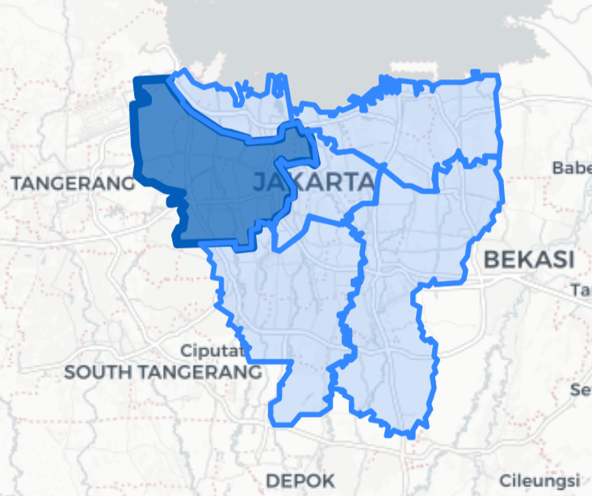
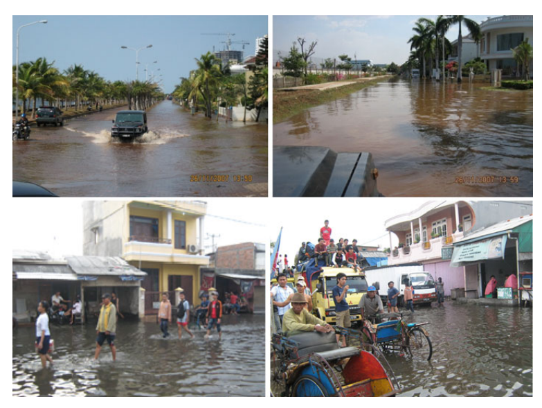
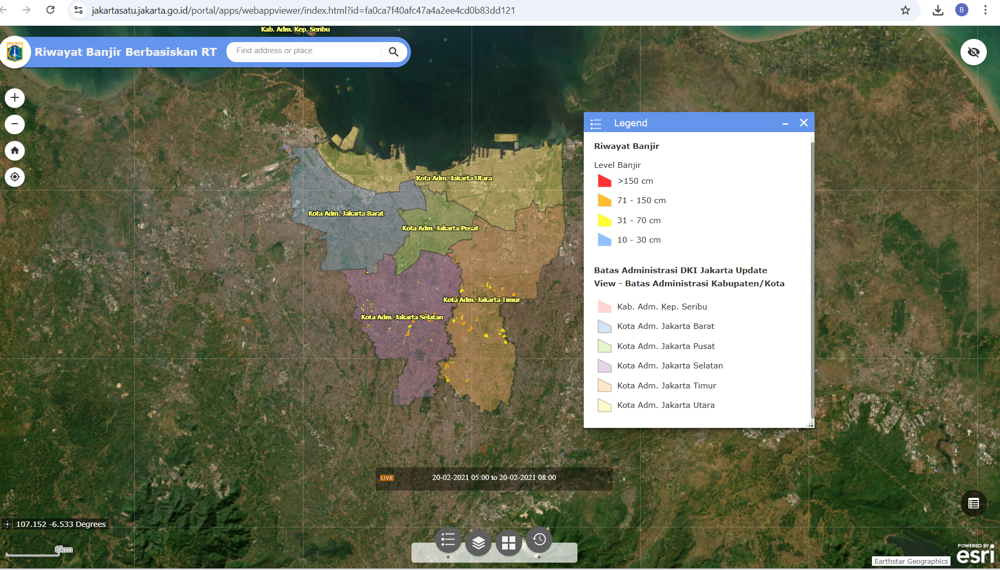
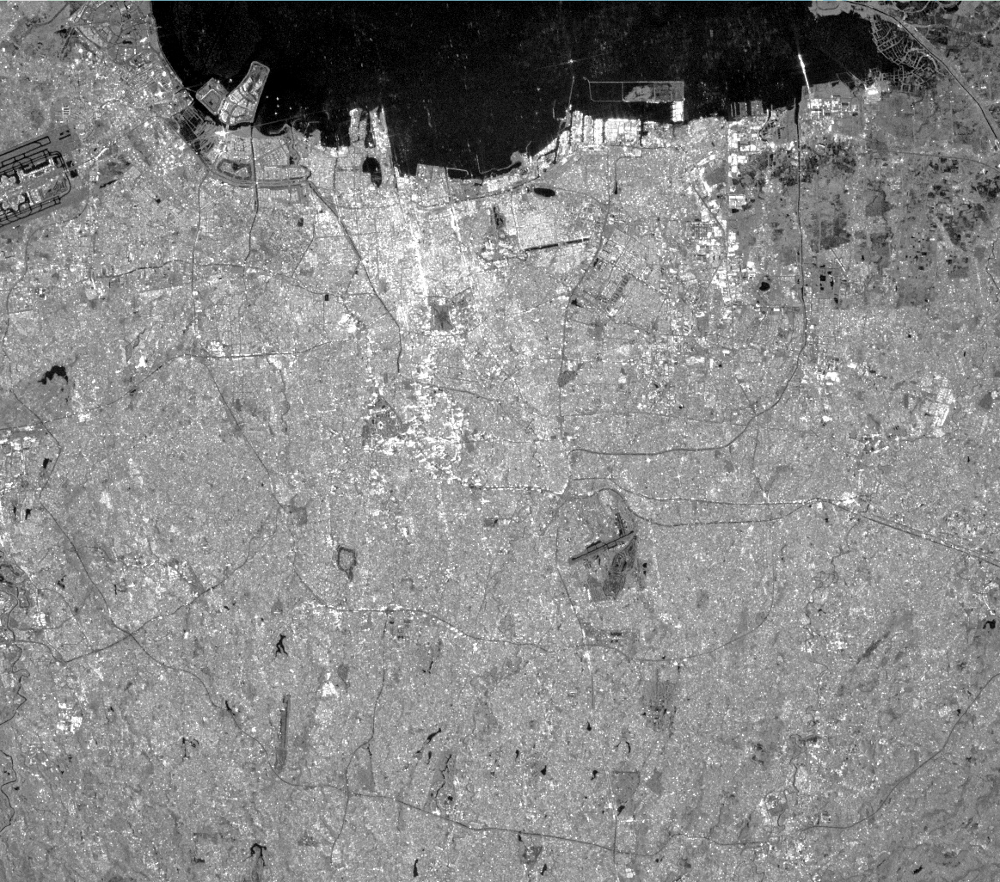
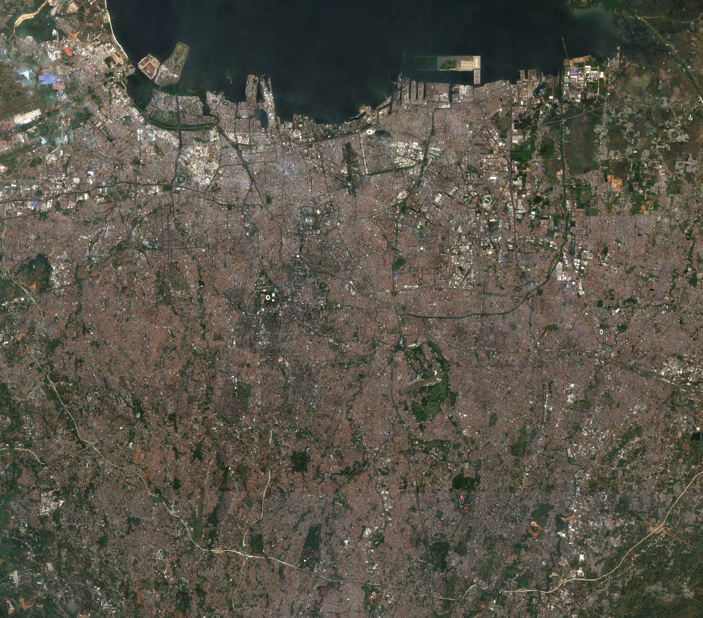
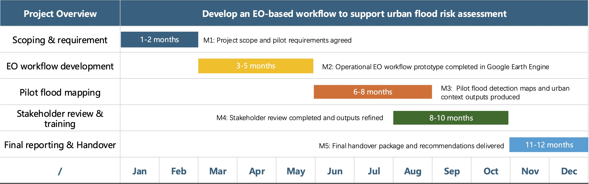

## Study Case: Jakarta

::::: columns
::: column
-   Capital city of Indonesia\
-   Population of approximately 10.5 million (BPS, 2023)\
-   Coastal Megacity\
-   Located on a low-laying deltaic plain intersected by 13 rivers (Abidin et al., 2015)\
:::

::: column
{width="100%"}
:::
:::::

------------------------------------------------------------------------

## Urban Problem

::::: columns
::: column
Jakarta is highly vulnerable to flooding, driven by:\

-   Land subsidence (up to 25cm/year in some areas) (Abidin et al., 2011)\
-   Sea level rise and coastal exposure\
-   Rapid urbanisation and landuse change\

Impacts:\

-   Disruption to infrastructure and urban mobility\
-   Economic losses\
-   Major flood events (2007, 2011, 2013, 2020)\
:::

::: column
{width="100%"}
:::
:::::

------------------------------------------------------------------------

## Policy Context

Global Frameworks:\

-   SDG 11 (UN, 2015): urban resilience and sustainable cities\
-   SDG 13 (UN, 2015): climate adaptation and mitigation\
-   Sendai Framework (UNDRR,2015): disaster risk reduction and resilience building\

Local Policies:\

-   BNPB: disaster mitigation, emergency response, and recovery\
-   Jakarta flood management: drainage improvement and river normalization\
-   NCICD (National Capital Integrated Coastal Development): coastal protection and sea defense infrastructure\

------------------------------------------------------------------------

## Research Gap

::::: columns
::: column
-   Flood events are spatially widespread across Jakarta\
-   Existing data are mostly event-based and static (not real time)\
-   Limited high-resolution spatial monitoring\
-   Current approaches do not fully capture flood dynamics\
-   Earth Observation (EO) enables near real-time monitoring\
:::

::: column
{witdh="100%"}
:::
:::::

------------------------------------------------------------------------

## Sentinel-1 SAR: Flood Detection Capability

::::: columns
::: column
-   Synthetic Aperture Radar (SAR) captures surface backscatter\
-   Water surfaces → low backscatter (dark areas)\
-   Effective under cloud cover and during extreme weather\
-   Suitable for rapid flood detection in urban environments
:::

::: column
{width="120%"}
:::
:::::

------------------------------------------------------------------------

## Sentinel-2 Optical: Urban Context

::::: columns
::: column
-   Multispectral imagery provides land surface information\
-   Identifies urban areas, vegetation, and infrastructure...\
-   Supports interpretation of flood impacts in built environments
:::

::: column
{width="120%"}
:::
:::::

------------------------------------------------------------------------

## EO Workflow for Flood Detection in Jakarta

::::: columns
::: column
-   Integration of SAR and optical EO data\
-   Cloud-based processing using Google Earth Engine\
-   Robust flood detection using SAR backscatter\
-   Urban context interpretation using optical imagery\
:::

::: column
{width="75%"}
:::
:::::

------------------------------------------------------------------------

## Integration into City Data Workflows

::::: columns
::: column
-   EO-based flood detection enables **near real-time monitoring** of urban flooding\
    using Sentinel-1 SAR, which is robust to cloud cover (Twele et al., 2016)

-   Outputs can be integrated into **GIS-based dashboards**, supporting spatial\
    decision-making across urban systems (Schumann & Di Baldassarre, 2010)

-   Cloud platforms such as **Google Earth Engine enable scalable and automated\
    processing pipelines**, reducing technical and operational barriers

-   Facilitates a shift from **reactive disaster response to proactive,\
    data-driven urban governance**, enhancing urban resilience (Tellman et al., 2021)
:::

::: column
{style="width: 120%; display: block; margin: 0 auto;"} <small> Example of a GIS-based dashboard for flood monitoring and decision support (Source: UNOSAT) </small>
:::
:::::

------------------------------------------------------------------------

## Project Structure and Work Packages {.wp-slide}

::::: columns

::: {.column .wpbox .wp1}
### WP1 - Scoping

- confirm policy and operational needs in Jakarta
- define priority flood use cases
- align expected outputs with city users
:::

::: {.column .wpbox .wp2}
### WP2 - Workflow

- translate the proposed EO workflow into an operational pilot
- organise Sentinel-1 / Sentinel-2 processing steps in Google Earth Engine
- define standard output formats
:::

::: {.column .wpbox .wp3}
### WP3 - Pilot Mapping

- produce pilot flood detection maps
- generate urban context layers
- identify recurrent flood hotspots
:::

:::::

::::: columns

::: {.column .wpbox .wp4}
### WP4 - Review & Training

- review pilot outputs with users
- collect feedback on usability
- support training and uptake
:::

::: {.column .wpbox .wp5}
### WP5 - Handover

- deliver final outputs and documentation
- prepare a handover package
- provide recommendations for future rollout
:::

:::::

------------------------------------------------------------------------

## Project Timeline and Milestones

{width="94%" fig-align="center"}

*Phased pilot approach from scoping → workflow → testing → uptake.*

------------------------------------------------------------------------

## Key Deliverables {.deliverables-slide}

::::: columns

::: {.column width="20%"}
### D1  
**Scoping and Requirements Brief**

- user needs  
- priority use cases  
- expected outputs  
:::

::: {.column width="20%"}
### D2  
**EO Workflow Prototype**

- operational workflow in Google Earth Engine
- standard processing steps
- output specification 
:::

::: {.column width="20%"}
### D3  
**Pilot Outputs Package**

- flood detection maps  
- urban context maps  
- hotspot identification  
:::

::: {.column width="20%"}
### D4  
**Review & Training Materials**

- feedback summary  
- training notes / user guide  
:::

::: {.column width="20%"}
### D5  
**Final Handover Package**

- final outputs  
- implementation recommendations  
- scaling strategy  
:::

:::::
------------------------------------------------------------------------

## Stakeholder Engagement Plan {.wp-slide .big-text}

::::: columns

::: {.column width="33%"}
### Who

- Disaster management agencies
  (e.g. BNPB / relevant disaster management users)

- Urban planning and public works teams
  (drainage, infrastructure, planning relevance)

- Jakarta GIS / geoportal data users
  (spatial data integration and uptake)

- Local stakeholders / end users
  (flood-prone communities)
:::

::: {.column width="33%"}
### When

- Month 1 — Kick-off workshop
  confirm needs, priorities and outputs  

- Month 6 — Mid-project technical review  
  review workflow readiness and pilot design  

- Month 8–9 — Pilot feedback session
  assess usability of flood maps and outputs  

- Month 12 — Final training & handover 
  support adoption and scaling
:::

::: {.column width="33%"}
### Why

- ensure outputs match city needs 

- improve usability of EO products

- support cross-sector coordination 

- strengthen operational uptake  
:::

:::::

------------------------------------------------------------------------

## Estimated Spending Plan and Value for Money {.wp-slide .budget-final}

::::: columns

::: {.column width="55%"}
### Budget Allocation

WP1 — £50k  

WP2 — £140k  

WP3 — £130k  

WP4 — £80k  

WP5 — £100k  

**Total: £500k**
:::

::: {.column width="45%"}
### Value for Money

- Uses openly available Sentinel EO data  

- Employs Google Earth Engine for scalable processing  

- Focuses on a realistic pilot rather than a full rollout  

- Creates outputs that support future planning and resilience decisions  
:::

:::::

Overall, the proposal is designed to be realistic, cost-effective and scalable within the available budget.

------------------------------------------------------------------------

## Reference

Abidin, H. Z., Andreas, H., Gumilar, I., & Wibowo, I. R. R. (2015). On correlation between urban development, land subsidence and flooding phenomena in Jakarta. Proceedings of the International Association of Hydrological Sciences, 370, 15–20. https://doi.org/10.5194/piahs-370-15-2015 :contentReference[oaicite:0]{index="0"}\

Abidin, H. Z., Andreas, H., Gumilar, I., Fukuda, Y., Pohan, Y. E., & Deguchi, T. (2011). Land subsidence of Jakarta (Indonesia) and its relation with urban development. Natural Hazards, 59, 1753–1771.\

Badan Pusat Statistik (BPS). (2023). Jakarta in Figures 2023.BPS-Statistics Indonesia.\

Jakarta Satu. (n.d.). Jakarta Satu Geoportal.https://jakartasatu.jakarta.go.id/\

Schumann, G.J.-P. & Di Baldassarre, G. (2010) The direct use of radar satellites for event-specific flood risk mapping. Hydrological Processes.

Tellman, B. et al. (2021) Satellite imaging reveals increased proportion of population exposed to floods. Nature.

Twele, A. et al. (2016) Sentinel-1-based flood mapping: a fully automated processing chain. Remote Sensing.

United Nations. (2015). Transforming our world: The 2030 Agenda for Sustainable Development.\

United Nations Office for Disaster Risk Reduction (UNDRR). (2015). Sendai Framework for Disaster Risk Reduction 2015–2030.\

